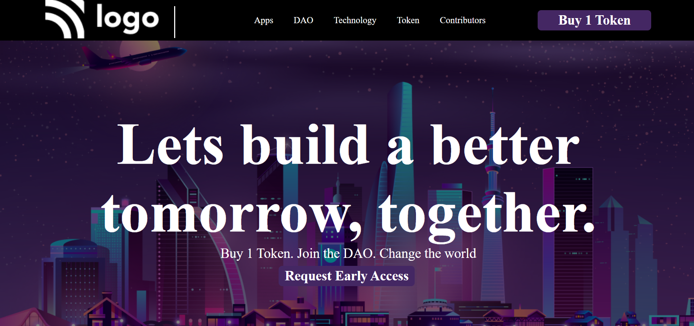

# Build-a-Better-tomorrow
# [vercel](https://vercel.com/mohanverse/build-a-better-tomorrow/JG5bMUN71qmqQy6HrozT2GZG3Lcm)
## Project 5 | Interior-disign <a><button name="button" style = "color: red" onclick="https:">`HTML CSS` project 5</button></a>
### By mohanverse

# Live Link-: [ Build-a-Better-tomorrow]( Build-a-Better-tomorrow)

# What I Learned from this project

* This project gave me good learning experience.

* I learned how to use HTML and CSS to create a beutiful website.

* I learned about the ways of positioning elements in the HTML and CSS.
* I learn in this project in deapt of CSS

